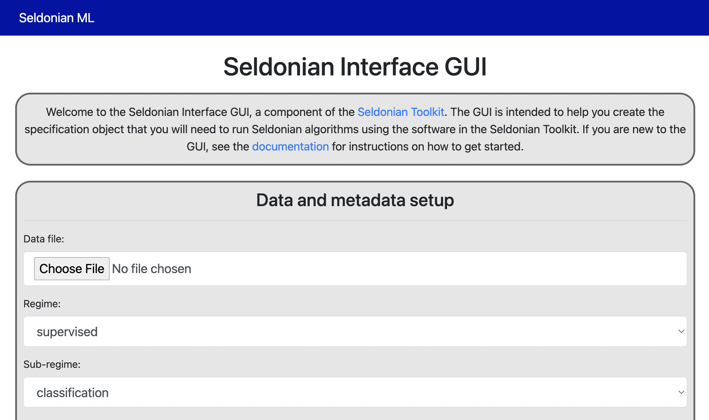
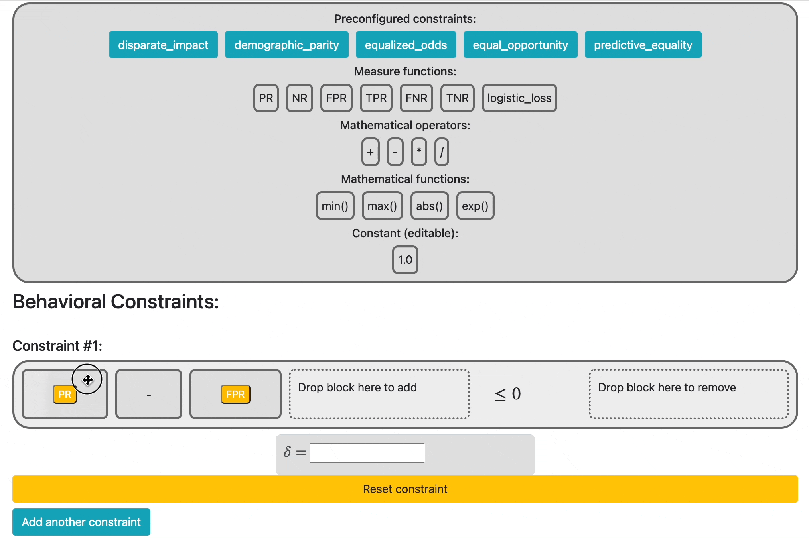
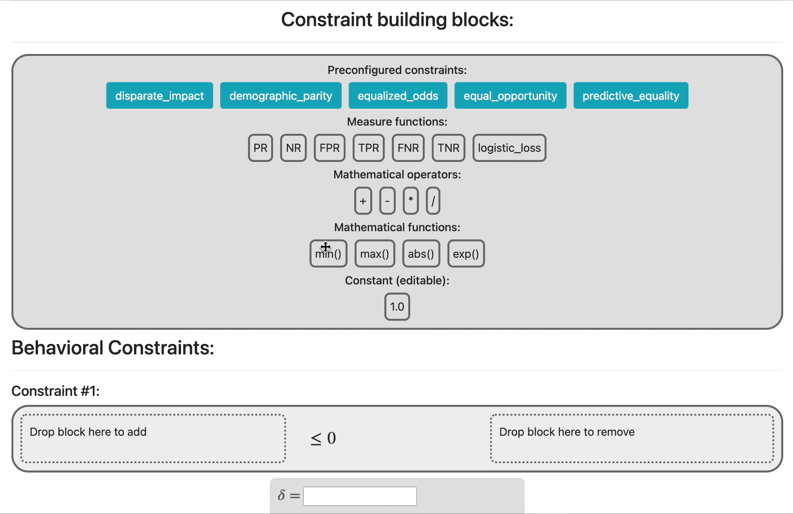

Seldonian Interface GUI documentation
=============================================
Welcome to the documentation for the Seldonian Interface GUI. This GUI is one example of a Seldonian interface, which is how a user provides data and constraints to a Seldonian algorithm. The source code for the GUI is hosted on `GitHub <https://github.com/seldonian-toolkit/GUI>`_.

.. _installation:

Installation
------------

First, clone the GUI repo:

.. code:: 

    $ git clone https://github.com/seldonian-toolkit/GUI.git

This will create a folder called "GUI" wherever you ran the above command. Enter that folder, and run the following from the command line (after entering your virtual environment, if relevant): 

.. code::

    $ pip install -r requirements

.. _running_gui:

Running the GUI
---------------

The GUI runs as a webserver on your local machine. Run the GUI by entering the following from the command line. Again, make sure you have activated your virtual environment first, if relevant:

.. code::

    $ python run.py

This will start the webserver running at localhost:5001 on your local machine. Copy and paste that address (or alternatively 127.0.0.1:5001) into your browser and you should see a page displaying something like the following: 

   GUI welcome screen

.. _using_gui:

Using the GUI
---------------

GUI overview
++++++++++++

To use the GUI, first complete the "Data and Metadata setup" section. Upload your data file in CSV format, then fill out the rest of the fields in that section. Next, build your constraints and enter the values for :math:`{\delta}`, the confidence level, for each constraint. Finally, hit "Submit" when you are done building your constraints. The GUI will save a specification ("spec.pkl") file to your filesystem that you can use to run the Seldonian Engine or the Seldonian Experiments library.

Building constraints
++++++++++++++++++++
Build your constraints by clicking and dragging boxes from the "Constraint building blocks" section into the constraint areas in the "Behavioral Constraints" section at the bottom of the page. Specifically, drag new blocks into the dotted block where it says "Drop block here to add". When a new block is dragged over the correct drop area, the area will turn green, indicating that it is ready to accept the block. Once a block is released (let go of click), it should become solid, and a new dotted block area will appear to its right where you can drop new blocks. The following gif illustrates this:

.. figure:: _static/drop_block.gif
   :width: 100 %
   :alt: drop block
   :align: center

   Creating a solid block from a new block

Dropping a new block onto an existing solid block that is a math function (e.g., "min()") will result in a composition (see `Block types and their uses`_). Continue drag-and-dropping blocks until you are satisfied with the mathematical expression you have built. 

For supervised classification problems, we have preconfigured five commonly used fairness constraints for your immediate use:

- Disparate impact
- Demographic parity
- Equalized odds
- Equal opportunity
- Predictive equality

These appear as buttons under the "Preconfigured constraints" sub-section shown in the previous gif. Clicking one of these buttons will auto-fill the mathematical expression for that constraint into the last empty constraint. If no constraints are empty, a new constraint will be created and auto-filled. These auto-filled constraints are editable once added to the page.

Each of these five preconfigured constraints represents a different definition of fairness between **two sensitive groups**. As a result, clicking one of these buttons requires that at least two attributes are listed in the "sensitive attributes" field of the metadata setup section. If you have fewer than two attributes listed, it will auto-fill the sensitive attributes "M,F" into that field and then use those in the auto-filled constraint string.

Adding, removing, and modifying constraints
+++++++++++++++++++++++++++++++++++++++++++

To add additional constraints, click the blue "Add another constraint" button at the bottom of the "Behavioral Constraints" section. To remove a constraint, click the red "Remove this constraint" button below the constraint. Constraint #1 cannot be removed because at least one constraint is required. However, any constraint can be reset to its original, blank state by clicking the "Reset constraint" button just below the constraint's :math:`{\delta}` box. 

If you want to remove a single solid block from a constraint, click and drag it over to the dotted block area on the right where it says "Drop block here to remove." That area will turn red once the removal is ready. Let go of the click and the block will disappear from the constraint.

.. figure:: _static/remove_block.gif
   :width: 100 %
   :alt: remove block
   :align: center

   Removing a solid block from an existing constraint

To rearrange the position of a solid block within a constraint, click and drag the solid block over another solid block in the same constraint. When the border of the second block becomes dotted, the swap is ready to be performed. Letting go of the mouse at this point will exchange the positions of the two solid blocks. 

   Swapping the position of two solid blocks 

Both removing blocks and swapping blocks work on blocks within a composition as well (see `Block types and their uses`_). Removing the parent block in a composition removes the parent and all of its children from the constraint.

Block types and their uses
++++++++++++++++++++++++++

There are four block types: 

1. Measure functions
####################

These are special strings, such as "PR" (which stands for "positive rate") that are interpreted as statistical functions in the Seldonian engine. Hover over these boxes to see their plain English definition. A full list of measure functions and their meanings can be found `here <https://seldonian-toolkit.github.io/Engine/build/html/_autosummary/seldonian.parse_tree.operators.html#seldonian.parse_tree.operators.measure_functions_dict>`_. The available measure functions differ depending on the regime and sub-regime. For example, positive rate is only defined for classification, not regression or reinforcement learning.

When the supervised learning regime is selected, the measure functions will be clickable once dropped into the constraint area. Clicking them will bring up a dropdown menu, allowing you to select one or more sensitive attributes from the list you entered in the metadata setup section (if any). Below is a demonstration:

.. figure:: _static/measure_functions.gif
   :width: 100 %
   :alt: measure functions
   :align: center

   Adding sensitive attributes to measure functions (supervised learning only)

As attributes are selected from the dropdown, the text of the block changes accordingly. In the gif, the sensitive attribute "female" is selected first from the dropdown (left click), and the block text then reads "(FPR| [female])". The "|" character acts as a filter, where the interpretation of "(FPR| [female])" is: calculate the false positive rate from datapoints where the column "female" is True. A second sensitive attribute, "race_white", is selected (command + left click), and the block text changes to: "(FPR| [female,race_white])". When multiple sensitive attributes are selected, they filter together as logical ANDs. "(FPR| [female,race_white])" is interpreted as: calculate the false postive rate from datapoints where the columns "female" and "race_white" are both True. It is perfectly valid to not select any sensitive attributes from the dropdown. For example if the block just reads "FPR", then the false positive rate will be calculated on all datapoints in the dataset. 

2. Mathematical operators
#########################
The addition (+), subtraction (-), multiplication (*) and division (/) operators are supported. They act as normal blocks and have special additional capabilities.

3. Mathematical functions 
#########################
The four supported math functions: min, max, abs (absolute value), and exp (base-e exponent) are "composable", i.e., they take other blocks as arguments. To perform a composition, first drag a math function block into the constraint to make it solid. Then, drag any type of new block (including another math function block) from the "Constraint building blocks" area onto the math function block you just created. The outline of the existing block will turn from solid to dotted to indicate when the composition drop can be made. 

   Drag-and-dropping a new block into an existing solid math function block creates a "composition"

Continue dragging additional blocks onto the same solid math function block to add to the argument of the function.

The min and max blocks must take two arguments, whereas abs and exp blocks take a single argument. To add a new argument to a min or max block, click on the blue "min" or "max" block text. After clicking, a comma will appear, and any new blocks dragged into the block area will be added to the final argument currently available. 

All math function blocks are infinitely composable. For example, "min(max(min(max(abs(..." is supported. Take care when adding blocks to the arguments of nested math function blocks. The border of the block which will be modified by the drop will become dotted when dragged over.

.. figure:: _static/nested_compose.gif
   :width: 100 %
   :alt: nested compose
   :align: center

Note that a composition can only be performed by dragging in a new block to a solid math block; dragging other solid blocks onto a solid math function block will swap the two blocks and will not result in a composition. 

4. Constant
###########
This block is editable so that you can add constant numerical values to your constraints. The block must be edited in the "Constraint building blocks" area before being dragged to a constraint. To add a different constant, simply edit the constant in the building box area and drag to a new box. Once dropped, constants act like normal blocks with no additional capabilities. They cannot be modified once dropped.

.. figure:: _static/constant_block.gif
   :width: 100 %
   :alt: constant block
   :align: center

